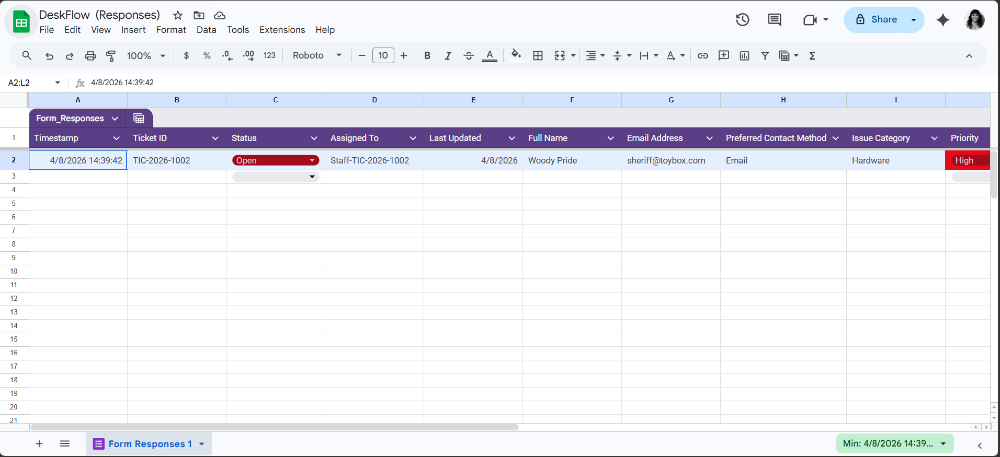
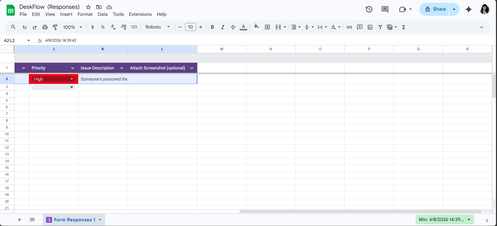
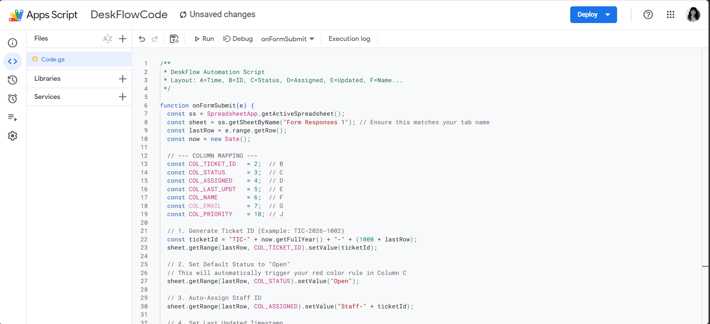
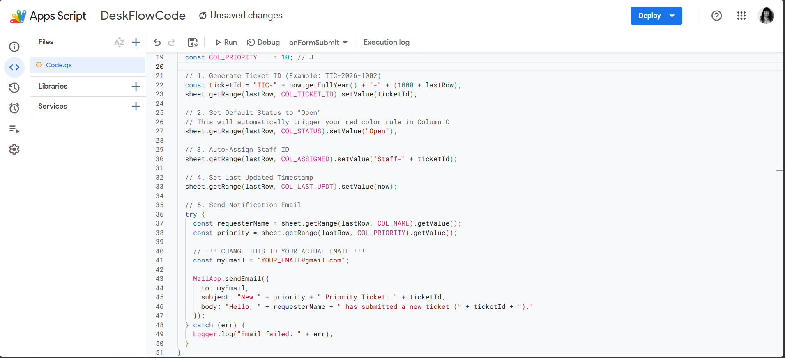

# IT-Ticketing-System

## Project Description
My Helpdesk Ticketing System project is an automation tool that uses Google Sheets and Google Apps Script to collect user inquiries, manage tickets, and track status.

## Tools
* **Google Forms** (Front-end for inquiry submission)
* **Google Sheets** (Backend database for inquiries)
* **Google Apps Script** (Server-side scripting to create IDs and send emails)
* **Gmail** (Used by Apps Script to send email notifications)

## Features
* **Auto-Generated Ticket IDs:** Creates a new unique ID (e.g., TIC-2026-1002) for every new Google Form submission.
* **Instant "Open" Status:** Automatically sets new tickets to "Open" in red so no new request is overlooked.
* **Real-Time Data Validation:** Built-in dropdown menus for status and priority to prevent typing errors.
* **Urgency Alerts:** Highlights "High" priority tickets in bright red to prioritize critical issues.

## Screenshots 

**1. DeskFlow Spreadsheet Dashboard**

Displays the automated spreadsheet dashboard with unique IDs, auto-filled statuses, staff assignments, color-coded priorities, and issue descriptions.

**2. Backend Automation Code**

Features the Apps Script code for creating unique IDs, mapping columns, sending email alerts, and tracking timestamps.
